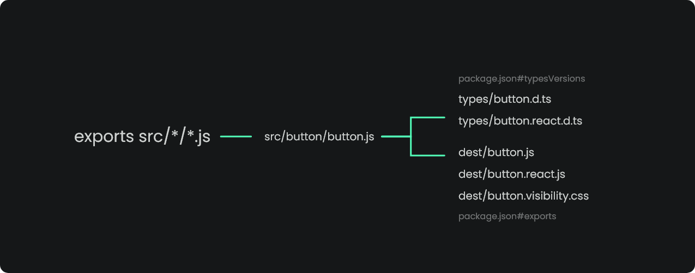

# CLI and Flags





Simplify the generation of builds, types and exports by distributing webcomponents in NPM, with `@atomico/exports` you will be able to:

1. Exporting multiple files using example expressions: `exports src/components/*.{js,jsx}`.
2. Automatically associate package.json#exports. flag `--exports`
3. Automatically associate types for typescript package.json # typesVersions. flag `--types`
4. Optimize build distribution thanks to ESbuild.
5. Import the assets by using import.meta.url, improving the consumption of assets from CDN.
6. Add support for generic Atomico-based CSS modules.
7. [Automatically create wrapper to use webcomponents in react](atomico-exports/wrapper-for-react.md)
8. Minificar el código. flag `--minify`.
9. Centralize workspace in a single installation package. flag `--workspace <spaces>`.
10. Automatically create CSS visibility files for customElements found in export, example `my-component:not(:defined){ visibility: hidden }`

## Installation



```bash
npm install -D @atomico/exports
```



```javascript
{
    /**
     * ⚠️ The --types flag requires the installation of @typescript
     */
    "scripts": "exports src/components/*/*.js --exports --types"
}
```



## Flags

### --exports

You will add the build files to the exports property inside the package.json.

### --types

It requires the installation of Typescript, it will create the types and add the files to the typesVersion property inside package.json

### --analyzer

Analyze the code to generate output for third parties like react and preact

### --workspace

It will look for the subpackages that declare dependencies and it will add them in the dependencies property of the package.json

### --ignore-build

Avoid using esbuild, ideal if you have standard js code that you want to distribute without compilation

### --meta-url \<tipo de archivo>

Add additional support for files not found by [default in meta-url export](https://github.com/atomicojs/exports/blob/master/src/module.js#L23-L42).

### --main \<nombre>

Of all the exported files, it will associate the one censored with the name of the file as the main one for the export of the package.json

### --dest \<destino>

Modify the destination directory for the build

### --watch

Associate the use of watch with esbuild, ignoring the type parsing and exports.

### --minify

Enables minify esbuild code.
