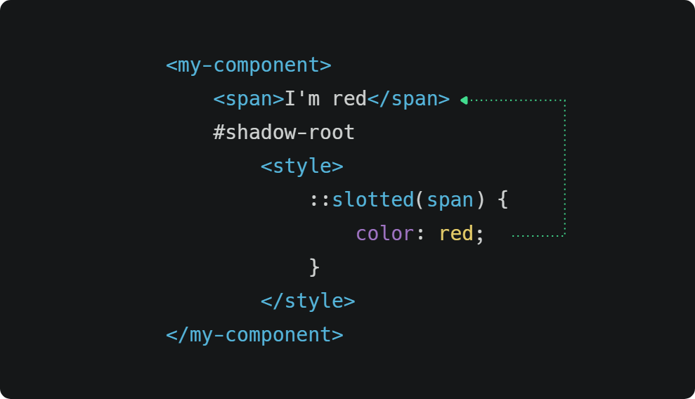

# 🔀 Slot

The use of slots improves the composition allowing to reflect the content exposed in the `lightDOM` of the component in the `shadowDOM` of this, example:



The use of slot is thanks to the use of the **ShadowDOM** api, to make use of the shadowDom you must declare it as a property of the host tag, example:

`<host shadowDom>`I exist inside the shadowDOM`</host>`


### ::slotted(\<selector>)

The `slotted` selector allows the manipulation of the content exposed as a `lightDOM` slot from the `shadowDOM`, example:



### Auto slot

With Atomico you can define a default slot for your components, this is useful if you want to maintain some compositional consistency without the need to declare the use of slot, example:

```markup
<my-component>
    <my-component-header></my-component-header>
    <my-component-footer></my-component-footer>
</my-component>
```

To define a default slot you only have to declare the prop slot in the props, example:

```javascript
myComponentHeader.props = {
    slot: { type:String, value: "header"}
}

myComponentFooter.props = {
    slot: { type:String, value: "footer"}
}
```

Consider this practical only if the composition is leveraged to the container, this does not prevent you from modifying the slot property from the component instance.

### Conditional slot

Atomico has the hook [**@atomico/hooks/use-slot**](../atomico/atomico-hooks/use-slot.md) that appends the slotchange event to a reference, this will allow you to hide slots if they do not declare content, example:

```jsx
import { useRef } from "atomico";
import { useSlot } from "@atomico/hooks/use-slot";

function component(){
    const ref = useRef();
    const childNodes = useSlot(ref);
    return <host shadowDom>
        <header style={{
            display: childNodes.length? "block": "none"
        }}>
            <slot name="header" ref={ref}/>
        </header>
    </host>
}
```
